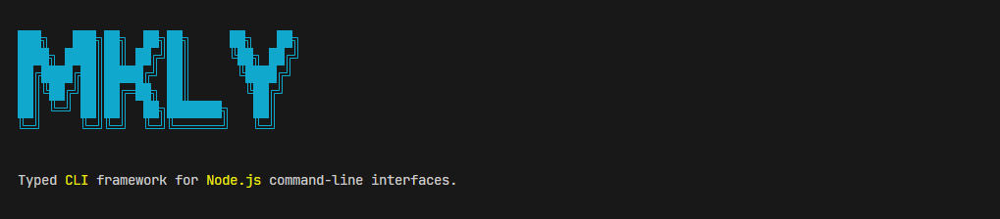

<p align="center">
  
</p>

<p align="center">
  <a href="./LICENSE">
    
  </a>
  <a href="https://npmjs.org/package/mkly">
    
  </a>
  <a href="https://npmjs.org/package/mkly">
    
  </a>
  <a href="https://packagephobia.now.sh/result?p=mkly">
    
  </a>
  <a href="https://bundlephobia.com/result?p=mkly">
    
  </a>
</p>

# mkly

**mkly** is a modern CLI framework designed with a relentless focus on **user experience**, **ease of use**, and **expressiveness**. It empowers developers to build CLI tools that greet users with friendly, clear, and beautiful interfaces.

## Features

- **UX First**: Auto-generates beautiful, readable help pages and error messages.
- **Expressive Parsing**: Natural parsing of arguments and options.
- **Rich Value Types**: First-class support for `Time`, `Size`, `Paths`, and `JSON`.
- **Modular & Composable**: Easily build nested subcommands and reusable command modules.
- **Type-Safe**: Designed with TypeScript in mind for a robust development experience.
- **Fast & Lightweight**: Minimal overhead, perfect for tools of any size.

## Installation

```bash
npm install mkly
# or
bun add mkly
# or
yarn add mkly
```

## Usage

The examples directory contains several usage patterns. Here are key highlights.

### Basic Command

Quickly define a CLI with commands, arguments, and actions.

```typescript
import { CLI } from 'mkly';

const cli = new CLI('greeter', '1.0.0');

cli
  .command('greet')
  .description('Greets a person')
  .argument('name', { type: 'string' })
  .argument('age', { type: 'number' })
  .action((args) => {
    // args is typed based on definitions
    console.log(`Hello ${args.name}, you are ${args.age} years old`);
  });

cli.run();
```

**Run it:**
```bash
$ mycli greet "John Doe" 30
Hello John Doe, you are 30 years old
```

### Options & Flags

Options can be defined with types, aliases, and default values. `mkly` handles the parsing and validation for you.

```typescript
cli
  .command('build')
  .description('Builds the project')
  .option('minify', {
    type: 'boolean',
    alias: ['m', 'min'],
    defaultValue: false,
  })
  .option('target', {
    type: 'number',
    defaultValue: 18,
  })
  .action((_, opts) => {
    console.log('Options:', opts);
  });
```

**Run it:**
```bash
$ app build --minify -t 20
Options: { minify: true, target: 20 }
```

### Supported Value Types

`mkly` comes with a powerful parser capable of handling various data types out of the box.

| Type | Description | Valid Input Examples |
| :--- | :--- | :--- |
| `boolean` | Boolean flag | `true`, `false`, `1`, `0`, `yes`, `no`, `on`, `off` |
| `string` | Text string | `"foo"`, `bar` |
| `number` | Numeric value | `42`, `3.14` |
| `choice` | Set of allowed values | `"red"`, `"green"`, `"blue"` |
| `path` | File system path | `./src`, `/etc/config` |
| `time` | Duration or Date | `5s`, `1h30m`, `2025-01-01` |
| `size` | Digital storage size | `10kb`, `500mb`, `1gb` |
| `json` | JSON object | `{"key": "value"}` |

> **Arrays**: All types support array variants (e.g., `stringArray`, `numberArray`).

#### Time Type
The `time` type is incredibly flexible. It supports:
- **Durations**: `100ms`, `5s`, `10m`, `1.5h`, `2d`, `1w`, `1mo`, `1y`
- **Compound Durations**: `1h30m`, `2d12h`
- **Dates**: `2025-12-31`, `2025-12-31 23:59` (parsed relative to `now`)

#### Size Type
The `size` type makes handling file sizes intuitive:
- **Units**: `b`, `kb`, `mb`, `gb`, `tb`, `pb`
- **Values**: `10kb` (10240 bytes), `1.5gb`, `500b`

### Nested Subcommands

Organize complex tools (like `git`) using nested subcommands.

```typescript
const remote = cli.command('remote').description('Manage remotes');

remote.command('add')
  .argument('name', { type: 'string' })
  .argument('url', { type: 'string' })
  .action((args) => {
    console.log(`Adding remote ${args.name} -> ${args.url}`);
  });

remote.command('remove')
  .argument('name', { type: 'string' })
  .action((args) => {
    console.log(`Removing remote ${args.name}`);
  });
```

## Running Examples

The repository includes a set of examples demonstrating different features. You can run them directly with Bun:

```bash
# Basic Hello World
bun examples/basic-hello.ts greet Parsa 25

# Options Demo
bun examples/options.ts build --minify --target 20

# Real World "Vite-like" CLI
bun examples/real-world.ts dev --port 8080

# Error Handling Demo
bun examples/errors.ts divide a 0
```

## Contributors

Thanks to these amazing people:

<!-- ALL-CONTRIBUTORS-LIST:START - Do not remove or modify this section -->
<!-- prettier-ignore-start -->
<!-- markdownlint-disable -->
<!-- markdownlint-restore -->
<!-- prettier-ignore-end -->

<!-- ALL-CONTRIBUTORS-LIST:END -->

## License

MIT © Kkotero

## Contributing

Issues and pull requests are welcome.

---
<p align="center">
  Built with ❤️ for great developer and user experiences.
</p>

